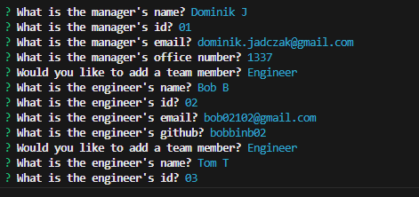
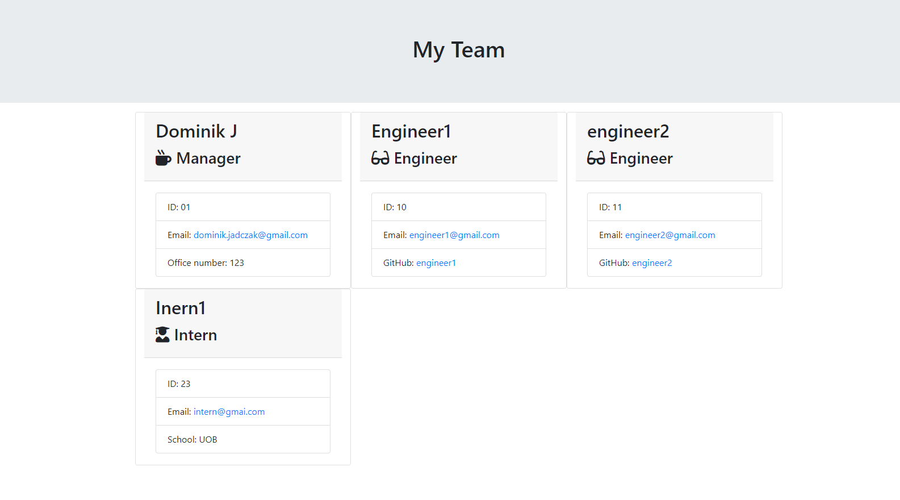

# Team Profile Generator 
 
  ## Description
  A terminal based team profile generator that generates a simple webpage with team information displayed for the user to visualise. User is prompted questions to answer about the team in the terminal. The user answers questions for each team member they want to include in their project, the questions start with the project manager and then the user has the option to add as many engineers and interns as they want. The team profile webpage is generated in the output folder based on these answers. 
  
  ## Table of Contents

  <details>
  <summary>Table of Contents</summary>
  <ol>
    <li><a href="#Description">Description</a></li>
    <li><a href="#Installation">Installation</a></li>
    <li><a href="#Screenshots">Screenshots</a></li>
    <li><a href="#Usage">Usage</a></li>
    <li><a href="#Contributing">Contributing</a></li>
    <li><a href="#Tests">Tests</a></li>
    <li><a href="#Questions">Questions</a></li>
    <li><a href="#License">License</a></li>
  </ol>
  </details>

  ## Installation
  Ensure you have Node.js installed on your machine. You can download and install Node.js from <a href="nodejs.org"> nodejs.org</a>.

  1. Open your terminal or command prompt.

  3. Navigate to where you want to clone this repo and run the command: 

  4. ``` git clone git@github.com:Dominik-Jad/team-profile-generator.git ```

  5. Run the following command to install the Team Profile Generator package from npm:

  6. ``` npm install team-profile-generator ```

  Once the installation is complete, you can use the Team Profile Generator by running the appropriate commands in your terminal:

  7. ``` node index.js ```
  ## Screenshots 
  




  ## Usage
  The main usage of this project is to allow project manager to see how many people are working on a project and all of their contact information. It makes it easy for the manager to contact their team members. 

  ## Contributing
  
  Contributing to the Team Profile Generator project via pull requests is simple: fork the repository, clone it to your local machine, create a new branch for your changes, make and commit your modifications, push them to your fork, then submit a pull request. Be sure to provide a clear title and description for your pull request, and be responsive to any feedback or requests for changes from project maintainers. Once your pull request is approved, your changes will be merged into the main branch of the Team Profile Generator repository.

  ## Tests
  To run tests please use the following command:
  ``` npm run test ```

  ## Questions
  If you have any questions about the repo, open an issue or contact me directly at dominik.jadczak@gmail.com. You can find more of my work at https://github.com/dominik-jad
  
  ## Credits 

  fs - https://nodejs.org/api/fs.html

  jest - https://www.npmjs.com/package/jest

  inquirer - https://www.npmjs.com/package/inquirer


  ## License
  This project is licensed under the MIT license
